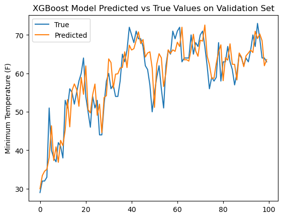
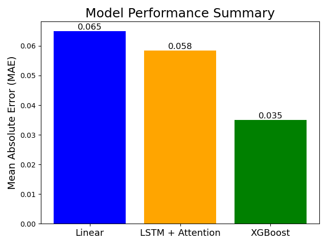

# Weather Prediciton Kaggle Challenge Submission

This repository contains the code and resources used for participating in the [Weather Prediction Kaggle competition](https://kaggle.com/competitions/weather-prediction-2025) [1]. The goal of the competition is to predict the minimum temperature of the next day given weather data from the past 2 weeks. The solution presented here achieved a mean absolute error (MAE) of 3.51% on the test set, **reaching the second place in the [leaderboard](https://www.kaggle.com/competitions/weather-prediction-2025/leaderboard)**.

## Approach

Three different machine learning models were implemented and evaluated for this task: linear regression, XGBoost, and an LSTM with attention mechanism. The XGBoost model was found to perform the best on the validation set and was used for generating the final submission.

With the XGBoost model, all the weather features were used, including maximum temperature (F), minimum temperature (F), precipitation (inches), snow (inches), and snow depth (inches). To predict the min temperature of the next day, lag features from the past 4 days were created for each feature. Additionally, the month of the year was included as a categorical feature to capture seasonal patterns. The best feature set was determined through grid search on the validation set. The predictions on the validation set are shown on Figure 1. 

<figure>
    
    <figcaption>Figure 1: XGBoost Model Predictions on Validation Set</figcaption>
</figure>

The baseline linear regression model reached a MAE of 6,49% on the test set. The LSTM loosely followed the approach in [2], resulting on a test MAE of 5.84%. The results are summarized in Figure 2.

<figure>
    
    <figcaption>Figure 2: Model Comparison on Test Set</figcaption>
</figure>

## References

[1] Alex Wycoff. Weather Prediction 2025. https://kaggle.com/competitions/weather-prediction-2025, 2025. Kaggle.
[2] Nketiah, Edward Appau, et al. "Recurrent neural network modeling of multivariate time series and its application in temperature forecasting." Plos one 18.5 (2023): e0285713.